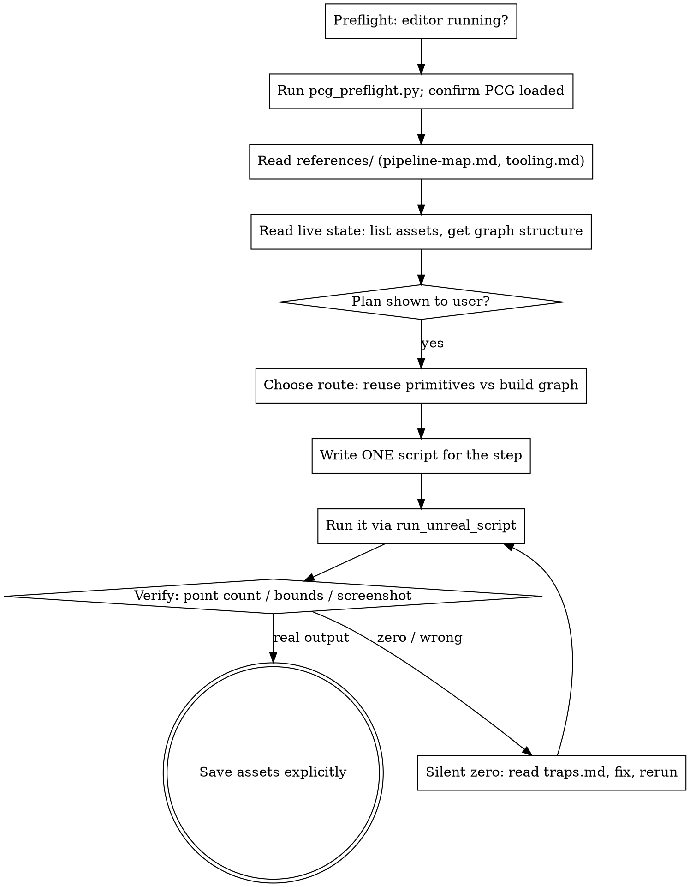

# 用 PCG 搭程序化城市（PCG_Claude）

## Overview

本项目的 PCG 工作通过**唯一的 MCP 工具** `run_unreal_script` 驱动：
它把 `Content/Python/` 下的 `.py` 交给编辑器内嵌 Python 执行，stdout 与 `mcp_result` 一并回传。
**没有工具集**——没有 `PCGToolset`、没有 `EditorToolset` 家族、没有 `GetNodeDataView`，
所以「找资产、建图、加节点、连线、执行、验证」**全部要自己写 Python 调 `unreal.*`**。

城市生成的**方法论**参照业已分析的 Epic City Sample PCG 流水线
（`docs/city-sample-pcg-pipeline.md`）：分阶段、阶段间按名字取上游 Actor 数据、
人工只画样条、随机性集中在末端。

> **2026-09-23 重大变更：Epic 的 18 张图与 27 个建筑样式资产已经搬进本项目了。**
> 连同约 62 GB 美术资产，挂载在 `/CitySamplePCG/`（插件）与
> `/Game/{Building,Prop,Road,Megascans,…}`。
> **动手前先读 `references/migrated-citysample-library.md` —— 能用现成的就不要自建。**

**核心纪律：先探测 → 再规划 → 一个脚本一次往返 → 每步用数据验证。**

PCG 最大的风险不是报错，而是**静默零点**——配置错误不抛异常，
只是不出点、不出网格，看起来"跑通了"其实什么都没生成。
所以每一步都必须读点数或截图**实证**，不能凭"没报错"判断成功。

## Preflight

- **先跑探测脚本。** `run_unreal_script(script_path="pcg_preflight.py")`。
  它会报告 PCG 是否加载、`unreal.PCGGraph` 有哪些成员、有哪些 `*Settings` 类
  （节点调色板）、`PCGComponent` 有哪些方法、`/PCGPrimitives/*` 是否挂载。
  **本 skill 里所有 API 名称都必须先由这一步确认，不要凭记忆写调用。**
- **编辑器必须在运行**。若工具返回
  `Unreal editor not connected on 127.0.0.1:8777`，
  **停下来请用户启动编辑器**，不要反复重试。端口被占查
  `netstat -ano | findstr 8777`。
- **PCG 插件需已启用**。`PCG_Claude.uproject` 已加 `PCG` 与 `PCGPrimitives`
  （2026-09-23）；**若编辑器是在此之前启动的，必须先重启**，否则探测脚本会报告未加载。
- **`/CitySamplePCG/` 挂载点只在编辑器启动时注册。** 迁移进来的 18 张图与 27 个样式资产
  全在这个插件里，**改了 `.uproject` 或新拷了插件内容都必须重启编辑器**才可见。
  探针：`unreal.EditorAssetLibrary.does_directory_exist("/CitySamplePCG")`。
  反过来，`/Game` 侧的美术**不需要重启**——对 `/Game` 做一次
  `AssetRegistry.scan_paths_synchronous(["/Game"], True, True)` 就会注册进来。
- **脚本必须放 `Content/Python/` 下**。路径逃出该根、非 `.py`、文件不存在，桥一律拒绝。

## Main-line workflow



1. **探测** — 跑 `pcg_preflight.py`，确认 PCG 已加载且拿到真实的类名与方法名。
2. **读参考** — 读 `references/pipeline-map.md`（该建什么）
   与 `references/tooling.md`（怎么写调用）。
3. **读活状态** — 用 `unreal.EditorAssetLibrary.list_assets(...)` 摸清已有资产，
   必要时把图的节点结构 dump 成 `mcp_result`。
4. **给用户看计划** — 尤其**建新图**或**改结构**这类较大动作。
5. **一个脚本一步** — 每次 `run_unreal_script` 都是一次完整往返，
   把能合并的探查与修改**合并进同一个脚本**，不要为查三个属性发三次调用。
6. **验证** — 见下方"如何验证"。**没有验证的步骤不算完成。**
7. **保存** — 脚本不会自动落盘。用
   `unreal.EditorAssetLibrary.save_asset(path)` / `save_directory(path)` 显式保存。

## 两条路线

**路线 A —— 复用 PCGPrimitives 原语库（推荐起点）**

引擎自带 `PCGPrimitives` 插件：`/PCGPrimitives/Primitives` 下实测有 **86 个成品原语**（递归共 225 个资产，含各原语的 `_CoreProcess` 内部子图），其中 **84 个自含**（只引用引擎类与插件内资产，可直接在本项目用）；`Create_Mesh_Extrude` 与 `Create_Mesh_Planar` 两个引用了 `/Game/` 路径，**本项目可能缺资产，用前先确认**。
按动词分类：
`Assign / Compose / Copy / Create / Capture / Debug / Extract / Fill / Filter /
Get / Override / Place / Shared / Spawn / Subdivide / Trace / Transform / Write`。

自含子图**能直接用**；只有两个例外需注意：
`Create_Mesh_Extrude` 与 `Create_Mesh_Planar` 引用了 `/Game/` 内容，
在本项目**可能缺资产**，用前先确认。

**路线 B —— 自建图，走 City Sample 的同构分阶段法**

参照 `docs/city-sample-pcg-pipeline.md` §4.2 的数据流主线，按阶段拆图：
`骨架(路网网格 + 路口) → 路面 → 地块 → 建筑 → 植被 → 街道家具`，
每阶段一张图或一张图内的一个簇，阶段间用 `Get_ActorDataByRef` 按 Actor 名取上游数据。

**样板参考**：引擎自带
`/PCGPrimitives/Examples/City/City_Generator_Steps_1_Base` → `_7_city_contour`
七段串联图，把一张大图拆成七个顺序依赖的小图，是最贴近本路线的教材。

**路线 C —— 直接用搬进来的 City Sample 库（现在最优先）**

`/CitySamplePCG/` 下已经有 Epic 的 **18 张城市阶段图**（`Levels/PCG/PCG_1_1_Terrain` …
`PCG_5_2_OuterForest`）、**27 个建筑样式资产**（`PCG/DataAssets/Buildings/<CODE>/SGD_<CODE>_A`）、
7 段 `CitySample_Generator_Steps_*` 入门图，以及约 460 个形状语法规则。
`/Game/{Building,Prop,Road,Megascans,Material,…}` 是它们依赖的美术。

用法与两个硬约束见 `references/migrated-citysample-library.md`。**先记住**：

1. 这 18 张图之间靠 **Actor 引用**传数据（不是资产路径），
   单拎一张图出来挂到空关卡上**跑不出东西**；
2. 加载方式就是普通 PCG 图：`unreal.load_asset("/CitySamplePCG/Levels/PCG/PCG_3_3_1_Buildings")`
   → `set_graph` → `activate(True)` → `generate_local`。

**只要有一张现成图或一个现成样式资产能满足需求，就不要走路线 A/B 自建。**

**无论走哪条路线，都优先复用而不是从零建节点。**

## 如何验证（本项目没有 GetNodeDataView）

> **先记住这条**：生成是**异步**的。
> **同一次调用里 `generate_local` 之后立刻读 `get_generated_graph_output()` 会读到空集合**，
> 而且**不报错**——极容易被误判成"图没产出"。
> **必须两段式：一次调用生成，下一次调用读。** 详见 `references/node-classes.md` §0.6。

CitySample 那边用 `PCGToolset.GetNodeDataView` 读点数据——**本项目没有这个工具**。
实测可用的读法是**读结构体字段**（`FPCGDataCollection` 的方法在 Python 侧全是 `AttributeError`）：

```python
coll  = comp.get_generated_graph_output()                 # -> PCGDataCollection
items = coll.get_editor_property("tagged_data")           # -> TArray<FPCGTaggedData>
for it in items:
    pin  = it.get_editor_property("pin")
    wrap = it.get_editor_property("data")                 # -> FPCGDataPtrWrapper
    # 再解包 wrap 拿到 UPCGData，然后 get_num_points() / get_points()
```

其余手段（**先跑探测脚本确认哪一个真的可用**）：

- `PCGComponent.get_generated_graph_output()` 取回生成结果，再经
  `UPCGPointData.get_points()` / `get_point(index)` 读点（这两个是 `BlueprintCallable`）。
  **`get_num_points()` 也可用**——它在**基类** `UPCGBasePointData` 上是 `UFUNCTION`
  （`UPCGPointData` 里那个是 C++ override，别找错地方）。
- 生成的 Actor / 组件计数：遍历关卡 Actor，按类或标签统计。
- 视口截图：`unreal.EditorLevelLibrary` / 视口截图 API，**自己验证方法名**。
- **几何验证优先走数值（包围盒 / 顶点数 / Actor 数），不要目测截图**——
  PCG 的检视态会产生幻影可视化，肉眼不可靠。

### 关键：读出 0 点**不等于**图没生成

**实测（2026-09-23）**：用 `/CitySamplePCG/Examples/Building/Building_Staggered_HShape`
生成，`get_generated_graph_output()` 返回 **0 个 tagged data**，
但同一时刻 ISM 组件有 **151 个、实例 3129 个**。

原因：这类图**在中间就把几何 spawn 掉了**，输出 pin 本来就是空的。
"写了数据到输出 pin" 与 "spawn 了几何" 是**两件事**。

→ **验证 spawn 型图必须数实例**，不能只读输出点数：

```python
total = 0
for c in comp.get_owner().get_components_by_class(unreal.PrimitiveComponent):
    try:
        n = c.get_instance_count()          # InstancedStaticMeshComponent 上有
    except Exception:
        continue
    if n: total += n
# 还可读 c.get_editor_property("static_mesh").get_path_name()
# 判断用的是不是自己期望的那套美术（如 "/Game/Building/..." vs 代理盒）
```

**两条读数一起用**：输出点数管"图算到哪一步"，实例数管"落地产出了什么"。
两者不一致时以**实例数**为准——用户要的是几何，不是 pin 上的数据。

## Red flags — STOP

| 想法 | 现实 |
|---|---|
| "这个 API 名字我大概记得" | 本项目 API 可达面**必须先由 `pcg_preflight.py` 实测**。凭记忆写调用是本任务最常见的失败来源。 |
| "执行成功了，没报错" | PCG 静默零点是常态。**必须读点数或统计 Actor 数**才算通过。 |
| "多查几个属性就多发几次调用" | 每次调用是完整往返。**合并进一个脚本**，否则时间全浪费在往返上。 |
| "先并行跑几个任务快一点" | 脚本在**游戏线程**执行，且**没有任何超时**。串行、小步。 |
| "`mcp_result` 直接塞对象就行" | 必须 **JSON 可序列化**。`unreal.Vector`/`Name`/Actor 都不行，且**失败时报错无用**。 |
| "用 `unreal.log` 输出结果" | `log_*` 与 `sys.stderr` **不进 stdout**。要回传就 `print` 或写进 `mcp_result`。 |
| "截图看着没问题" | PCG 检视态有幻影可视化。数值验证优先。 |

## References

- `references/migrated-citysample-library.md` — **本项目现在能直接用的 City Sample 资产库**：
  `/CitySamplePCG/` 的 18 张图与 27 个样式资产的确切路径、它们之间的 Actor 依赖、
  环境前置（哪些插件、为什么删掉 `ModelContextProtocol`/`AllToolsets`）、
  以及「62 GB 不进 git + `Tools/sync-citysample-assets.ps1` 重拉」的策略。
  **要用现成资产前必读。**
- `references/pipeline-map.md` — City Sample 的 18 阶段流水线、关卡装配、手绘样条、各阶段内部结构、形状语法、建筑样式码、World Partition 注意事项，以及**可搬迁 / 不可搬迁**的清单。**规划前必读。**
- `references/node-classes.md` — **PCG 节点类名表**：常用节点的确切类名与 `/Script/...` 加载路径、子图节点唯一正确的 `SetSubgraph()` 接法、从标题猜类名会失败的陷阱表，以及「动态输入 pin 加不了」这一硬限制。**写 `add_node_of_type` 前必读。**
- `references/tooling.md` — `run_unreal_script` 的调用形态与脚本契约、六大反直觉之处、拒绝时的确切报错串，以及**「CitySample 侧工具 → 本项目怎么写」的对照表**。**写调用前必读。**
- `references/traps.md` — 静默零点与实测坑（17 条）、项目硬约束、已实测的机制结论（资产解析链路、种子策略、代理与红盒兜底）。**遇到"跑通了但没结果"时读这个。**
- `references/stage-run-playbook.md` — **把 18 阶段跑一遍并逐阶段截图的操作手册**：
  自带的 11 个电影机位对照表、「PCG debug 没有全局开关」与限量理由、
  「一次调用只发一张截图」的落盘节奏、以及重载关卡会崩编辑器这条硬约束。
  **要跑这套流水线前必读。**
